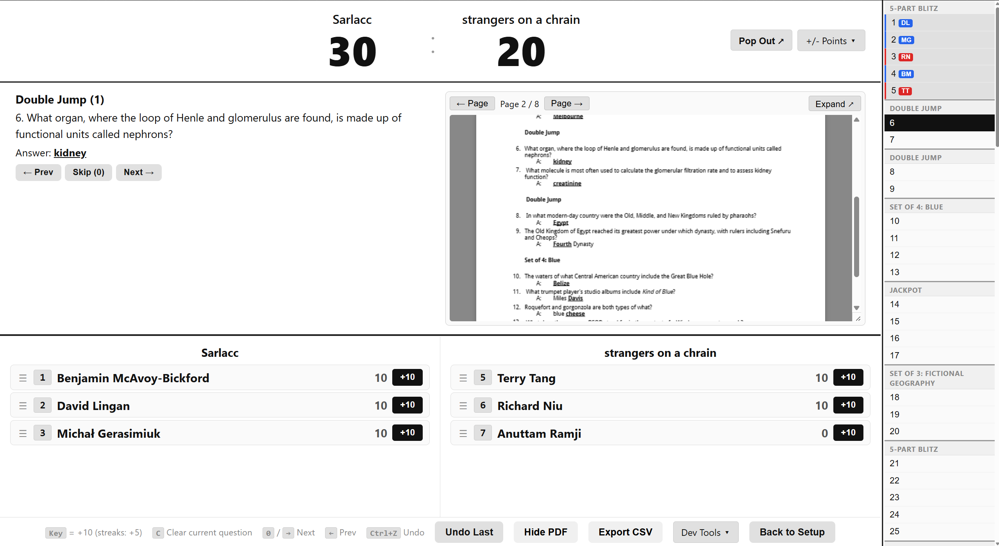
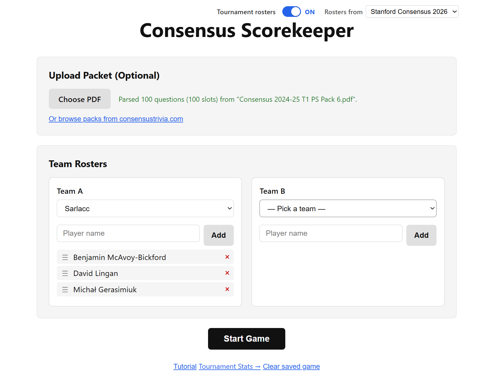
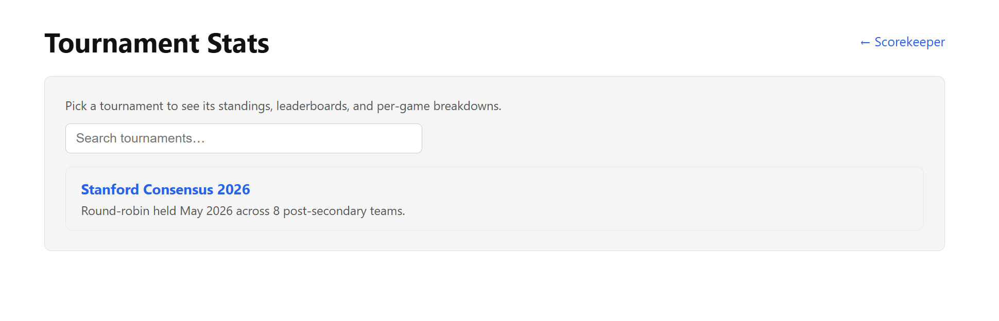
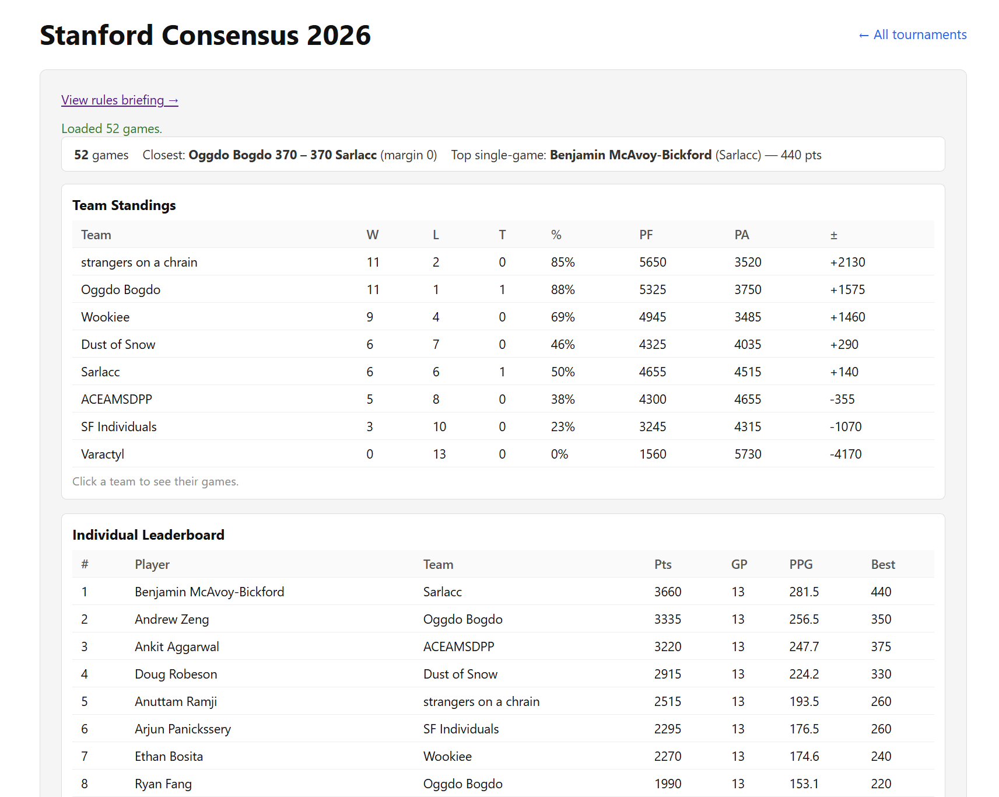
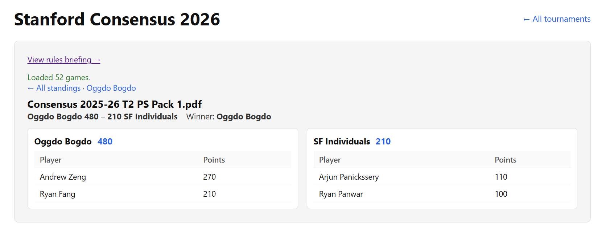
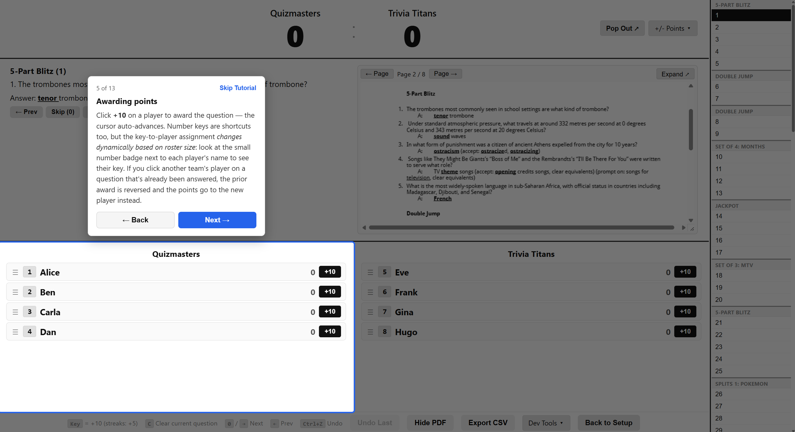

# consensus-scorekeeper

Scorekeeper and stats viewer for [Consensus](https://consensustrivia.com/) trivia tournaments. It runs in the browser against static files, so any HTTP server (or GitHub Pages) is enough to host it.



## Pages

The repo has four entry points.

`index.html` is the scorekeeper. You upload a packet (or pick one from the in-app browser of consensustrivia.com), set up rosters, and run the game. Most of the live scoring is keyboard-driven. "Export CSV" at the end writes one row per player.



`tournaments/` is a hub page that lists every tournament hosted on the site, with a search box if the list grows.



`tournaments/<slug>/` is one tournament's stats page. It reads the CSV exports from `results/manifest.json` in the same folder and shows standings, an individual leaderboard, per-team and per-player drill-downs, and a per-game breakdown.





`stats.html` is left over from before the hub existed; it just redirects to `tournaments/`.

## Running it

```
python serve.py
```

That starts a dev server on port 8000. The scorekeeper is at /, the hub at /tournaments/. The server also proxies `/proxy/` requests to consensustrivia.com, which is what lets the in-app pack browser work without CORS issues.

## Running a tournament

The intended workflow during a multi-room tournament:

1. Each room scores its game in `index.html` and clicks Export CSV at the end.
2. The CSVs get dropped into `tournaments/<slug>/results/`.
3. After pushing to GitHub, an Action regenerates that folder's `manifest.json`. The next visit to the tournament's stats page picks up the new games.

If you're testing locally without pushing, `scripts/update_manifests.py` does the same thing by hand.

To add a new tournament, append an entry to `TOURNAMENTS` in `src/ui/roster-presets.js`, then copy `tournaments/stanford-consensus-2026/index.html` into a new folder named after the slug and change the one `<meta name="tournament-slug">` tag inside. Drop CSVs into the new `results/` folder and the hub starts showing it.

## Roster modes

There's a "Tournament rosters" toggle in the top-right of the setup screen. When it's off (the default), you type team names freely. When it's on, the team-name fields become dropdowns of preset rosters from the chosen tournament; a second dropdown next to the toggle lets you pick which tournament's rosters to load.

The add-player autocomplete lists every player from every tournament regardless of mode, which is mostly there to keep subs' names from being misspelled.

## Tutorial

The setup screen has a Tutorial button that boots a sandbox session: preset rosters, a bundled sample pack, and a 13-step walkthrough that highlights each control.



The tutorial doesn't touch your saved game. Closing it reloads the page and restores whatever real session you had before.

## Tests

```
npm install
npm test
```

About 120 tests via Vitest + happy-dom. They cover the PDF question parser, the scoring reducers, the CSV export round-trip, the tournament aggregator, and a structural sweep over every CSV under `tournaments/*/results/`.

## Internal notes

`CLAUDE.md` has the architecture notes that aren't obvious from reading the code: state ownership, localStorage key conventions, what's allowed where between modules, and the runbook for adding a tournament. Worth reading before refactoring anything substantial.
